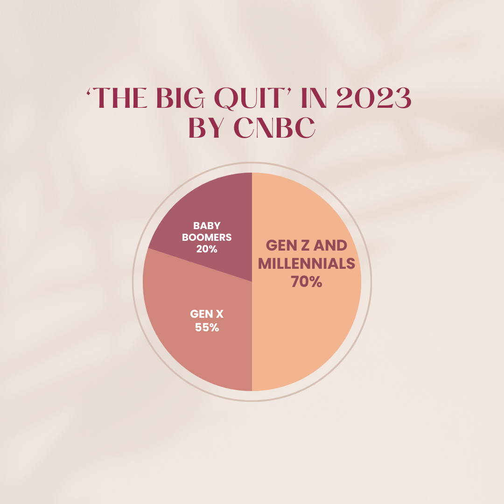

# Psychological Signs you may need to retrain

Studies show that people are changing jobs more frequently than ever before. According to CNBC, Gen Zers and millennials are leading ‘the big quit’ in 2023 - why nearly 70% plan to leave their jobs, compared to just 55% of Gen Xers (ages 42-57) and only 30% of baby boomers (ages 58-76). The crucial reasons Gen Zers and millennials are considering changing jobs haven’t changed, it is about finding 
a job that aligns with their values, and they are certain that switching job will help them to get there. Their goal is to have flexible work arrangements, carrier growth opportunities, a higher compensation, and improved work–life balance.

Every change is like landing on the other planet and starting to live there. This is how I feel during my journey to retrain. Having specialization in Teaching I transition to Tech by leveraging my practical skills gained during teaching and simultaneously mastering workshops and presentations. As an enthusiastic user of technologies, I was trying to find a field where technology and language go together and a role of Technical Writing turned out to be the perfect match to fit in and where my experience would be transferable and beneficial.

Among many factors to make a decision on switching career, we need an honest consideration of the below mentioned issues:

1. You're not Learning or Growing anymore
2. You feel Mentally and Physically Drained
3. Your Values are not in compliance With the Company's
4. You find yourself feeling bored and disengaged about Your Role 
5. You feel Undervalued and that Your Work Doesn't have any purpose
6. You're no longer satisfied with your career or you are envious of Other People's Careers
7. You dream about a Different Career Path and set next goals.

A career change can offer new opportunities, better pay, and increased fulfillment.
Change careers if you feel dissatisfied, angry, or disengaged from your work and colleagues.
Staying in a career you don't like can damage your mental and physical health.
Pursuing a new career may require additional training, certification, and education.

The most frequent reasons for these transitions are seeking better work-life balance, a more positive work culture, and more flexible scheduling.
Dreaming about a job more closely related to your interests or passions and new career goals may lead you to change your profession.
